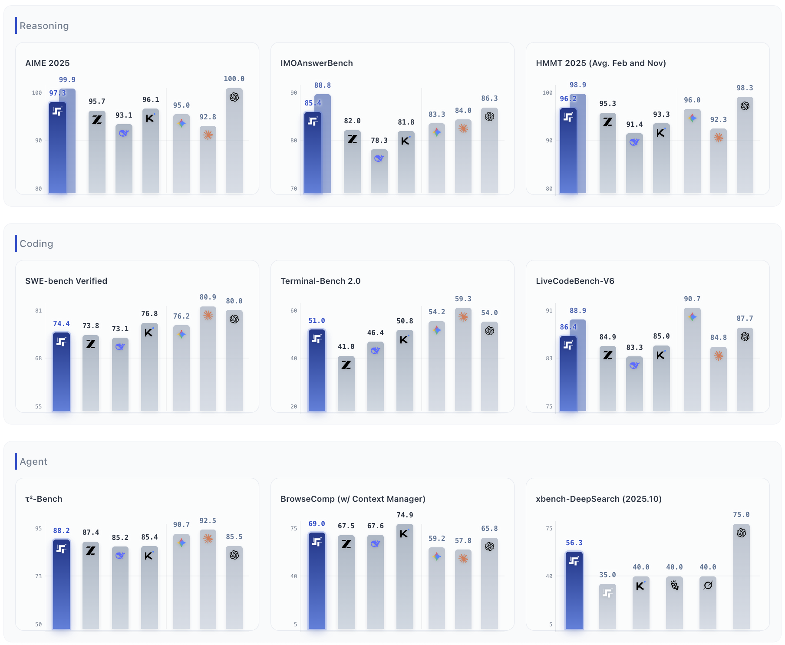

<!-- ---
license: apache-2.0
base_model:
  - stepfun-ai/step-3.5-flash
--- -->

# Step 3.5 Flash

<div align="center">
  
<div align="center" style="display: flex; justify-content: center; align-items: center;">
  
  <h1 style="margin: 0; border-bottom: none;">Step 3.5 Flash</h1>
</div>

<p align="center">
    <a href="README.md">English</a>&nbsp; | &nbsp;<strong>简体中文</strong>
</p>

[](https://huggingface.co/stepfun-ai/Step-3.5-Flash/tree/main)
[](https://modelscope.cn/models/stepfun-ai/Step-3.5-Flash)
[](https://discord.gg/RcMJhNVAQc)
[](https://openrouter.ai/chat?models=stepfun/step-3.5-flash:free)
[](https://huggingface.co/stepfun-ai/Step-3.5-Flash/tree/main)
[](https://static.stepfun.com/blog/step-3.5-flash/)
[]()

</div>

## 1. 简介

**Step 3.5 Flash** ([访问网站](https://static.stepfun.com/blog/step-3.5-flash/))是我们目前最强大的开源基座模型。它专为极致效率而生，具备前沿的推理能力和卓越的智能体（Agent）性能。该模型基于稀疏混合专家（MoE）架构，拥有 1960 亿参数，但处理每个 Token 时仅需选择性激活 110 亿参数。这种极高的“智能密度”使其推理深度足以媲美顶级闭源模型，同时兼顾了实时交互所需的敏捷响应速度。

### 目录
- [核心能力](#2-核心能力)
- [性能表现](#3-性能表现)
- [架构详情](#4-架构详情)
- [快速上手](#5-快速上手)
- [本地部署](#6-本地部署)
- [Agent框架接入](#7-agent框架接入)
- [已知问题与未来方向](#8-已知问题与未来方向)
- [共创未来](#9-共创未来)
- [License](#license)

## 2. 核心能力

- **兼具前沿智能与极速响应**： 聊天机器人重在“读”，而智能体必须快在“想”。得益于三路多Token预测（ MTP-3）技术，Step 3.5 Flash 在典型场景下的生成吞吐量可达 100–300 tok/s（单流代码任务峰值可达 350 tok/s）。复杂多步骤的推理链也能实现即时响应。

- **代码与智能体的稳健引擎**： Step 3.5 Flash 专为智能体任务打造，集成了可扩展的强化学习（RL）框架，驱动模型持续自我进化。它在 SWE-bench Verified 分数达到74.4%，在 Terminal-Bench 2.0 测试中分数达 51.0%，证明了其在处理复杂、长程任务时坚如磐石的稳定性。

- **高效的长上下文处理**： Step 3.5 Flash采用 3:1 的滑动窗口注意力（SWA）比例 （即每层全注意力层搭配三层 SWA 层），该模型支持极具成本效益的 256K 上下文窗口。这种混合机制确保了在处理海量数据或超长代码库时性能不减，同时显著降低了传统长上下文模型常见的计算开销。

- **便捷的本地部署**： Step 3.5 Flash 专为易用性优化，将高性能推理带入本地环境。用户在高端消费级硬件（如 Mac Studio M4 Max, NVIDIA DGX Spark）上即可部署，在确保数据隐私的同时，性能毫不妥协。

## 3. 性能表现

Step 3.5 Flash 在保持开源和高效的同时，提供了与领先闭源系统相当的性能。



上图显示的是Step 3.5 Flash 在推理、编程和智能体能力三个维度的性能表现。左侧开源模型按总参数量排序，右侧则列出了顶尖的闭源模型。为确保一致性，xbench-DeepSearch 的分数均取自官方发布数据。图中的阴影部分展示了 Step 3.5 Flash 启用“并行思考 (Parallel Thinking)”后的性能提升。

### 详细性能数据

| Benchmark | Step 3.5 Flash | DeepSeek V3.2 | Kimi K2 Thinking / K2.5 | GLM-4.7 | MiniMax M2.1 | MiMo-V2 Flash |
|---|---|---|---|---|---|---|
| # Activated Params | 11B | 37B | 32B | 32B | 10B | 15B |
| # Total Params (MoE) | 196B | 671B | 1T | 355B | 230B | 309B |
| Est. decoding cost (@ 128K context, Hopper GPU**) | **1.0x** (100 tok/s, MTP-3, EP8) | 6.0x (33 tok/s, MTP-1, EP32) | 18.9x (33 tok/s, no MTP, EP32) | 18.9x (100 tok/s, MTP-3, EP8) | 3.9x (100 tok/s, MTP-3, EP8) | 1.2x (100 tok/s, MTP-3, EP8) |
| **Agency** | | | | | | |
| τ²-Bench | **88.2** | 80.3 | 74.3* / — | 87.4 | 80.2* | 80.3 |
| BrowseComp | 51.6 | 51.4 | 41.5* / **60.6** | 52.0 | 47.4 | 45.4 |
| BrowseComp (w/ Context Manager) | 69.0 | 67.6 | 60.2 / **74.9** | 67.5 | 62.0 | 58.3 |
| BrowseComp-ZH | **66.9** | 65.0 | 62.3 / 62.3* | 66.6 | 47.8* | 51.2* |
| BrowseComp-ZH (w/ Context Manager) | **73.7** | — | — / — | — | — | — |
| GAIA (no file) | **84.5** | 75.1* | 75.6* / 75.9* | 61.9* | 64.3* | 78.2* |
| xbench-DeepSearch (2025.05) | **83.7** | 78.0* | 76.0* / 76.7* | 72.0* | 68.7* | 69.3* |
| xbench-DeepSearch (2025.10) | **56.3** | 55.7* | — / 40+ | 52.3* | 43.0* | 44.0* |
| ResearchRubrics | **65.3** | 55.8* | 56.2* / 59.5* | 62.0* | 60.2* | 54.3* |
| **Reasoning** | | | | | | |
| AIME 2025 | **97.3** | 93.1 | 94.5 / 96.1 | 95.7 | 83.0 | 94.1 (95.1*) |
| HMMT 2025 (Feb.) | **98.4** | 92.5 | 89.4 / 95.4 | 97.1 | 71.0* | 84.4 (95.4*) |
| HMMT 2025 (Nov.) | **94.0** | 90.2 | 89.2* / — | 93.5 | 74.3* | 91.0* |
| IMOAnswerBench | **85.4** | 78.3 | 78.6 / 81.8 | 82.0 | 60.4* | 80.9* |
| **Coding** | | | | | | |
| LiveCodeBench-V6 | **86.4** | 83.3 | 83.1 / 85.0 | 84.9 | — | 80.6 (81.6*) |
| SWE-bench Verified | 74.4 | 73.1 | 71.3 / **76.8** | 73.8 | 74.0 | 73.4 |
| Terminal-Bench 2.0 | **51.0** | 46.4 | 35.7* / 50.8 | 41.0 | 47.9 | 38.5 |

**说明**：
1. "—" 表示该分数未公开或未进行测试。
2. "*" 表示原始分数缺失，或低于我们的复现结果。因此，我们报告的是在与 Step 3.5 Flash 相同的测试条件下测得的数据，以确保比较的公平性。
3. **BrowseComp（配合上下文管理器）**： 当有效上下文长度超过预设阈值时，智能体（Agent）会重置上下文并重启循环。相比之下，Kimi K2.5 和 DeepSeek-V3.2 采用的是“全部丢弃 (discard-all)”策略。
4. **解码成本 (Decoding Cost)**： 估算基于类似于 arxiv.org/abs/2507.19427 中描述的方法，但精度更高。

## 4. 架构详情

Step 3.5 Flash 基于稀疏混合专家（MoE）Transformer 架构，针对推理期间的高吞吐量和低显存占用进行了优化。

### 4.1 技术规格

| 组件 | 规格 |
| :--- | :--- |
| **骨干网络** | 45层 Transformer（4096 隐藏层维度） |
| **上下文窗口** | 256K |
| **词汇表** | 128,896 tokens |
| **总参数量** | **196.81B**（196B 骨干 + 0.81B Head） |
| **激活参数量** | **~11B**（每 token 生成） |

### 4.2 混合专家（MoE）路由

与传统的稠密模型不同，Step 3.5 Flash 使用细粒度路由策略来最大化效率：
- **细粒度专家**：每层 288 个路由专家 + 1 个共享专家（始终激活）
- **稀疏激活**：每 token 仅选择 Top-8 专家
- **结果**： 模型保留了 196B 参数模型的“记忆容量”，但以 11B 模型的速度执行。

### 4.3 多Token预测（MTP）

为了实现 250+ TPS 的速度，我们利用了一个专门的 MTP Head，包含滑动窗口注意力机制和稠密前馈网络 (FFN)。该模块在单次前向传播中同时预测 4 个 token，在不降低质量的情况下显著加速推理。

## 5. 快速上手

您可以通过使用 API，在几分钟内开始使用 Step 3.5 Flash。

### 5.1 获取API Key

选择以下任一平台获取API Key。

> OpenRouter 现提供 Step 3.5 Flash 的免费试用。

| 提供商 | 网址 | Base URL |
| :--- | :--- | :--- |
| OpenRouter | https://openrouter.ai | https://openrouter.ai/api/v1 |
| StepFun (阶跃星辰) | https://platform.stepfun.com | https://api.stepfun.com/v1 |

### 5.2 安装

安装标准的 OpenAI SDK（兼容这两个平台）。

```bash
pip install --upgrade "openai>=1.0"
```

注意：OpenRouter支持多种SDK。点击 [此处](https://openrouter.ai/docs/quickstart) 了解更多。

### 5.3 示例

可参考以下代码段使用Step 3.5 Flash模型。需要注意的是，两个平台的 base_url 和模型 ID 不同，使用时需要根据平台进行切换。

```python
from openai import OpenAI

client = OpenAI(
    api_key="YOUR_API_KEY",
    base_url="https://api.stepfun.com/v1", # 或者 "https://openrouter.ai/api/v1"
    # 可选：OpenRouter 用于应用排名的 headers
    default_headers={
        "HTTP-Referer": "<YOUR_SITE_URL>", 
        "X-Title": "<YOUR_SITE_NAME>",
    }
)

completion = client.chat.completions.create(
    model="step-3.5-flash", # 若使用 OpenRouter，请用 "stepfun/step-3.5-flash"
    messages=[
        {
            "role": "system",
            "content": "You are an AI chat assistant provided by StepFun. You are good at Chinese, English, and many other languages.",
        },
        {
            "role": "user",
            "content": "介绍一下阶跃星辰 (StepFun) 的人工智能能力。"
        },
    ],
)

print(completion.choices[0].message.content)
```

## 6. 本地部署

Step 3.5 Flash 优化本地推理，支持行业标准后端：vLLM、SGLang、Hugging Face Transformers 和 llama.cpp。

### 6.1 vLLM

我们建议使用 vLLM 的最新 nightly 版本。

1. 安装 vLLM。

   ```bash
   # 通过 Docker
   docker pull vllm/vllm-openai:nightly
   
   # 或通过 pip（nightly 版本）
   pip install -U vllm --pre \
     --index-url https://pypi.org/simple \
     --extra-index-url https://wheels.vllm.ai/nightly
   ```

2. 启动服务。

   **注意**：vLLM 尚未完全支持 MTP3。我们正在积极开发 Pull Request 以集成此功能，预计将显著提升解码性能。

   - fp8 模型：
     ```bash  
     vllm serve <MODEL_PATH_OR_HF_ID> \
       --served-model-name step3p5-flash \
       --tensor-parallel-size 8 \
       --enable-expert-parallel \
       --disable-cascade-attn \
       --reasoning-parser step3p5 \
       --enable-auto-tool-choice \
       --tool-call-parser step3p5 \
       --hf-overrides '{"num_nextn_predict_layers": 1}' \
       --speculative_config '{"method": "step3p5_mtp", "num_speculative_tokens": 1}' \
       --trust-remote-code \
       --quantization fp8
     ```

   - bf16 模型：
     ```bash
     vllm serve <MODEL_PATH_OR_HF_ID> \
       --served-model-name step3p5-flash \
       --tensor-parallel-size 8 \
       --enable-expert-parallel \
       --disable-cascade-attn \
       --reasoning-parser step3p5 \
       --enable-auto-tool-choice \
       --tool-call-parser step3p5 \
       --hf-overrides '{"num_nextn_predict_layers": 1}' \
       --speculative_config '{"method": "step3p5_mtp", "num_speculative_tokens": 1}' \
       --trust-remote-code
     ```

### 6.2 SGLang

1. 安装 SGLang。

   ```bash
   # 通过 Docker
   docker pull lmsysorg/sglang:latest
   
   # 或从源码安装（pip）
   pip install "sglang[all] @ git+https://github.com/sgl-project/sglang.git"
   ```

2. 启动服务。
   - bf16 模型：
     ```bash
     SGLANG_ENABLE_SPEC_V2=1
     sglang serve \
       --model-path <MODEL_PATH_OR_HF_ID> \
       --served-model-name step3p5-flash \
       --tp 8 \
       --tool-call-parser step3p5 \
       --reasoning-parser step3p5 \
       --speculative-algorithm EAGLE \
       --speculative-num-steps 3 \
       --speculative-eagle-topk 1 \
       --speculative-num-draft-tokens 4 \
       --mem-fraction-static 0.8 \
       --host 0.0.0.0 \
       --port 8000
     ```
   - fp8 模型：
     ```bash
     SGLANG_ENABLE_SPEC_V2=1
     sglang serve \
       --model-path <MODEL_PATH_OR_HF_ID> \
       --served-model-name step3p5-flash \
       --tp 8 \
       --ep 8 \
       --tool-call-parser step3p5 \
       --reasoning-parser step3p5 \
       --speculative-algorithm EAGLE \
       --speculative-num-steps 3 \
       --speculative-eagle-topk 1 \
       --speculative-num-draft-tokens 4 \
       --mem-fraction-static 0.8 \
       --host 0.0.0.0 \
       --port 8000
     ```

### 6.3 Transformers（调试/验证）

使用此代码段进行快速功能验证。如需高吞吐量服务，请使用 vLLM 或 SGLang。

```python
from transformers import AutoModelForCausalLM, AutoTokenizer

MODEL_PATH = "<MODEL_PATH_OR_HF_ID>"

# 1. 设置
tokenizer = AutoTokenizer.from_pretrained(MODEL_PATH)
model = AutoModelForCausalLM.from_pretrained(
    MODEL_PATH,
    trust_remote_code=True,
    torch_dtype="auto",
    device_map="auto",
)

# 2. 准备输入
messages = [{"role": "user", "content": "解释数字42的意义。"}]
inputs = tokenizer.apply_chat_template(
    messages,
    tokenize=True,
    add_generation_prompt=True,
    return_dict=True,
    return_tensors="pt",
).to(model.device)

# 3. 生成
generated_ids = model.generate(**inputs, max_new_tokens=128, do_sample=False)
output_text = tokenizer.decode(generated_ids[0][inputs.input_ids.shape[1]:], skip_special_tokens=True)

print(output_text)
```

### 6.4 llama.cpp

#### 系统要求
- GGUF 模型权重（int4）：111.5 GB
- 运行时开销：~7 GB
- 最小显存：120 GB（如 Mac Studio、DGX-Spark、AMD Ryzen AI Max+ 395）
- 推荐：128GB 统一内存

#### 步骤
1. 使用[llama.cpp](llama.cpp/docs/step3.5-flash.md):
    ```bash
    git clone git@github.com:stepfun-ai/Step-3.5-Flash.git
    cd Step-3.5-Flash/llama.cpp
    ```
2. Mac 上构建 llama.cpp：
   ```bash
   cmake -S . -B build-macos \
     -DCMAKE_BUILD_TYPE=Release \
     -DGGML_METAL=ON \
     -DGGML_ACCELERATE=ON \
     -DLLAMA_BUILD_EXAMPLES=ON \
     -DLLAMA_BUILD_COMMON=ON \
     -DGGML_LTO=ON
   cmake --build build-macos -j8
   ```
3. DGX-Spark 上构建 llama.cpp：
   ```bash
   cmake -S . -B build-cuda \
     -DCMAKE_BUILD_TYPE=Release \
     -DGGML_CUDA=ON \
     -DGGML_CUDA_GRAPHS=ON \
     -DLLAMA_CURL=OFF \
     -DLLAMA_BUILD_EXAMPLES=ON \
     -DLLAMA_BUILD_COMMON=ON
   cmake --build build-cuda -j8
   ```
4. AMD Windows 上构建 llama.cpp：
   ```bash
   cmake -S . -B build-vulkan \
     -DCMAKE_BUILD_TYPE=Release \
     -DLLAMA_CURL=OFF \
     -DGGML_OPENMP=ON \
     -DGGML_VULKAN=ON
   cmake --build build-vulkan -j8
   ```
5. 使用 llama-cli 运行：
   ```bash
   ./llama-cli -m step3.5_flash_Q4_K_S.gguf -c 16384 -b 2048 -ub 2048 -fa on --temp 1.0 -p "你叫什么名字？"
   ```
6. 使用 llama-batched-bench 测试性能：
   ```bash
   ./llama-batched-bench -m step3.5_flash_Q4_K_S.gguf -c 32768 -b 2048 -ub 2048 -npp 0,2048,8192,16384,32768 -ntg 128 -npl 1
   ```

## 7. Agent框架接入

### 7.1 Claude Code和Codex接入
大部分情况下编程工具都可以很方便的接入Step 3.5 Flash模型使用，这里我们主要准备了Claude Code、Codex工具接入使用教程。

#### 7.1.1 配置准备
按前面准备工作注册阶跃星辰开放平台或者OpenRouter账号，获取API Key。

#### 7.1.2 环境准备
Claude Code和Codex工具运行均依赖Node.js环境，因此首先需要安装Node.js环境，建议Node.js版本在v20以上，可通过nvm工具安装管理Node.js版本。

**Mac/Linux环境安装**：
```bash
# Mac/Linux环境可使用以下命令安装nvm（使用curl）：
# 步骤1
curl -o- https://raw.githubusercontent.com/nvm-sh/nvm/v0.39.0/install.sh | bash

# 安装完复制log输出的最后几行执行
export NVM_DIR="$HOME/.nvm"
[ -s "$NVM_DIR/nvm.sh" ] && \. "$NVM_DIR/nvm.sh"  # This loads nvm
[ -s "$NVM_DIR/bash_completion" ] && \. "$NVM_DIR/bash_completion"

# 中国用户可以设置 npm 镜像源 
npm config set registry https://registry.npmmirror.com

# 步骤2
nvm install v22

# 检查 Node.js 是否安装成功
node --version

npm --version
```

**Windows环境安装**：
可通过下载nvm安装程序进行安装。
- 访问：[https://github.com/coreybutler/nvm-windows/releases](https://github.com/coreybutler/nvm-windows/releases)
- 下载 `nvm-setup.exe`
- 安装步骤：
  - 以管理员身份运行安装程序nvm-setup.exe
  - 接受许可协议
  - 选择安装路径（默认即可）
  - 设置 Node.js 符号链接路径（默认即可）
  - 运行nvm命令验证环境是否安装成功

#### 7.1.3 Step 3.5 Flash 接入 Claude code

1. 安装 Claude Code。
   ```bash
   # 通过npm安装claude-code
   npm install -g @anthropic-ai/claude-code
   
   # 验证是否安装成功
   claude --version 
   ```

2. 配置Claude Code。

   为适配不同场景的编程需求，针对Claude code的使用，我们提供了openai api协议和anthropic api协议两种使用方式。如果你想使用OpenRouter API，请参考OpenRouter集成指南。

   **方式一：Anthropic API协议使用**

   通过Anthropic API使用时只需配置下面信息至`~/.claude/settings.json`即可，文件原有配置信息不变。

   ```bash
   # 修改claude settings文件，
   vi ~/.claude/settings.json
   ```

   ```json
   {
     "env": {
       "ANTHROPIC_API_KEY": "从开放平台获取的apikey",
       "ANTHROPIC_BASE_URL": "https://api.stepfun.com/",
     },
     "model": "step-3.5-flash"
   }
   ```
   设置成功后可以执行Claude 启动并通过`/status`命令查看配置情况。

   ```txt
   ❯ /status
   ─────────────────────────────────────────────────────────────────────────────────
     Settings:  Status   Config   Usage  (←/→ or tab to cycle)
   
     Version: 2.1.1
     Session name: /rename to add a name
     Session ID: 676dae61-259d-4eef-8c2f-0f1641600553
     cwd: /Users/step-test/
     Auth token: none
     API key: ANTHROPIC_API_KEY
     Anthropic base URL: https://api.stepfun.com/
   
     Model: step-3.5-flash
     Setting sources: User settings
   ```

   **方式二：Openai API协议使用**

   > 这里Openai API协议指`chat/completions`。
   > 通过Openai API使用时我们推荐使用ccr的方式，详细使用可以参考这里 [https://github.com/musistudio/claude-code-router](https://github.com/musistudio/claude-code-router)。
   
   参考下面命令安装claude-code-router，注意，请确保已安装了Claude Code。

   ```bash
   # 通过npm安装ccr
   npm install -g @musistudio/claude-code-router
   
   # 验证是否安装成功
   ccr -v
   ```
     
   然后创建并配置以下信息至 `~/.claude-code-router/config.json`。

   ```json
   {
     "PORT": 3456,
     "Providers": [
       {
         "name": "stepfun-api",
         "api_base_url": "https://api.stepfun.com/v1/chat/completions",
         "api_key": "从开放平台获取的apikey",
         "models": ["step-3.5-flash"],
         "transformer":{
              "step-3.5-flash": { "use": ["OpenAI"]}
         }
       }
     ],
     "Router": {
       "default": "stepfun-api,step-3.5-flash",
       "background": "stepfun-api,step-3.5-flash",
       "think": "stepfun-api,step-3.5-flash",
       "longContext": "stepfun-api,step-3.5-flash",
       "webSearch": "stepfun-api,step-3.5-flash"
     }
   }
   ```
   配置完成后可以通过下面命令使用：

   ```bash
   # 启动Claude
   ccr code 
   
   # 重启ccr，如修改配置需要重启
   ccr restart 
   ```

#### 7.1.4 Step 3.5 Flash 接入 Codex

1. 安装 Codex。
   ```bash
   # 通过npm安装codex
   npm install -g @openai/codex
   
   # 验证是否安装成功
   codex --version
   ```

2. 配置Codex。
   在Codex 中使用step-3.5-flash，只需配置以下信息到`~/.codex/config.toml`即可，文件原有配置信息不变。

   ```toml
   model="step-3.5-flash"
   model_provider = "stepfun-chat"
   preferred_auth_method = "apikey"
   
   # 配置provider
   [model_providers.stepfun-chat]
   name = "OpenAI using response"
   base_url = "https://api.stepfun.com/v1"
   env_key = "OPENAI_API_KEY"
   wire_api = "chat"
   query_params = {}
   ```

   注意：在Codex使用时，`wire_api`仅支持chat模式，原有使用responses模式的注意修改。此外需要切换`model_provider`为新配置的`stepfun-chat`。

   设置成功后可以执行codex 启动并通过`/status`命令查看配置情况。

   ```bash
   /status
   📂 Workspace
     • Path: /Users/step-test/
     • Approval Mode: on-request
     • Sandbox: workspace-write
     • AGENTS files: (none)
   
   🧠 Model
     • Name: step-3.5-flash
     • Provider: Stepfun-chat
   
   💻 Client
     • CLI Version: 0.40.0
   ```

### 7.2 Step-DeepResearch（DeepResearch）框架接入

参考环境配置，直接将`MODEL_NAME`换成`Step-3.5-Flash`即可。[https://github.com/stepfun-ai/StepDeepResearch?tab=readme-ov-file#1-environment-setup](https://github.com/stepfun-ai/StepDeepResearch?tab=readme-ov-file#1-environment-setup)


## 8. 已知问题与未来方向

1. **Token 效率**： Step 3.5 Flash 虽然实现了前沿的智能体能力，但目前相比 Gemini 3.0 Pro，仍需更长的生成轨迹才能达到同等的质量水平。
2. **高效的全能精通**： 我们的目标是将通用模型的多面性与深度的领域专业知识相统一。为高效实现这一目标，我们正在推进“策略在线蒸馏”的变体研究，使模型能以更高的样本效率内化专家行为。
3. **面向更多智能体任务的强化学习**： 尽管 Step 3.5 Flash 在学术界的智能体基准测试中表现出很强的竞争力，但智能体 AI 的下一个前沿领域，要求将强化学习应用于专业工作、工程和研究中更为错综复杂的专家级任务。
4. **适用范围与限制**： Step 3.5 Flash 专为编程和以工作为中心的任务量身定制，但在遭遇“分布偏移”时稳定性可能会下降。这通常发生在高度专业化的领域或长周期的多轮对话中，模型可能会表现出重复推理、中英混杂输出，或在时间与身份认知上出现不一致。

## 9. 共创未来

我们将路线图视为持续发展的文档，会基于实际使用和开发者反馈不断演进。
在拓展模型能力、探索 AGI 未来的过程中，我们需要确保解决正确的问题。我们非常期待您的参与，您的反馈将直接决定我们的优先级。

- **加入阶跃星辰开发者社群**： ✨ 前沿资讯 + 免费Token + 工程师答疑 + 模型共创。
- **报告遇到的问题**： 如果发现模型局限或遇到问题，既可以在 GitHub 上提 Issue，也可以直接在群里反馈。
- 扫码即刻加入 👇

<div align="center">
  
</div>

## License
本项目采用 [Apache 2.0 License](https://www.apache.org/licenses/LICENSE-2.0) 开源。

