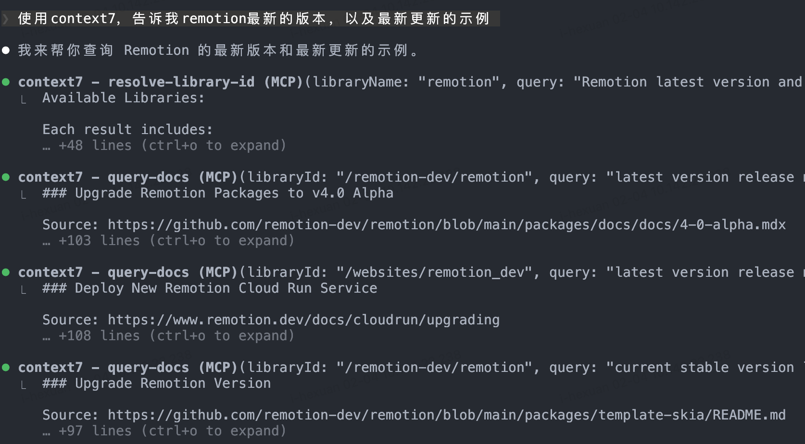
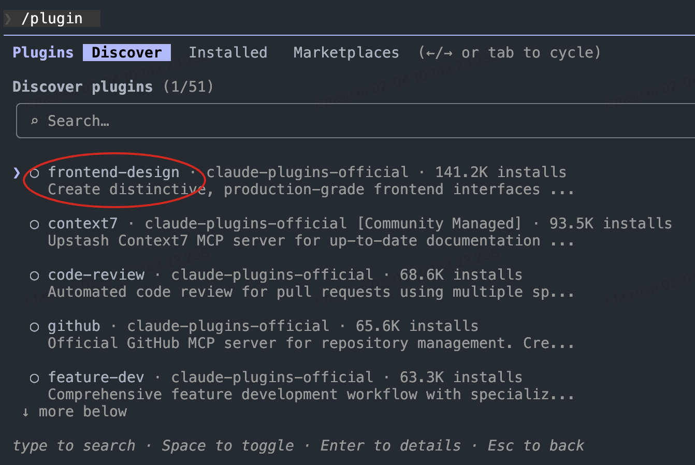
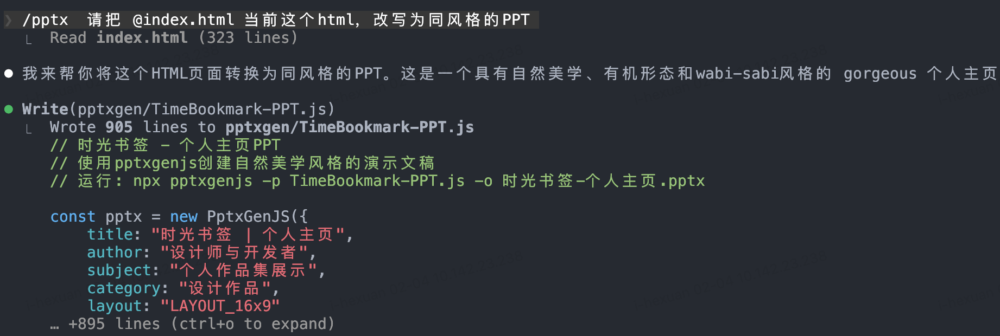
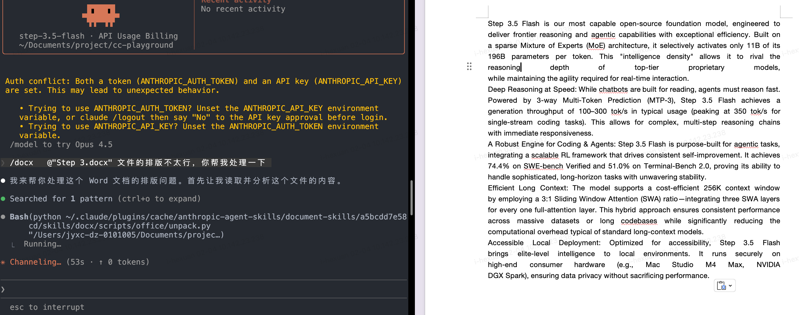
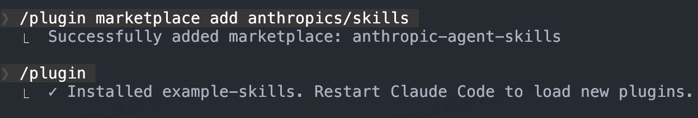

# Claude Code + Step 3.5 Flash 最佳实践指南

## 📖 概述

本文档提供了将 Claude Code 与 Step 3.5 Flash 结合使用的完整指南和最佳实践。通过配置 MCP 服务、Skills 插件和 Sub-agents，您可以显著提升 AI Agent 的开发效率和智能化水平。

**适用对象**：
- 使用 Claude Code 进行开发的软件工程师
- 需要 AI 辅助的数据分析师和研究人员
- 希望优化 AI Agent 工作流的团队

**您将学到**：
- 如何配置 Claude Code 接入 Step 3.5 Flash
- MCP、Skills、Sub-agents 的实际应用场景
- 提升开发效率的实用技巧

---

## 1. 环境配置

### 1.1 先决条件

在开始之前，请确保您具备以下条件：

- **Step 3.5 Flash API Key**：参考[官方快速上手指南](https://github.com/stepfun-ai/Step-3.5-Flash/blob/main/README.md#5-quick-start)获取
- **Claude Code**：已安装并可正常运行
- **系统要求**：macOS、Linux 或 Windows

### 1.2 安装步骤

#### 步骤 1: 配置 Step 3.5 Flash

按照[官方文档](https://github.com/stepfun-ai/Step-3.5-Flash/blob/main/README.md#7-using-step-35-flash-on-agent-platforms)完成 Claude Code 与 Step 3.5 Flash 的集成配置。

#### 步骤 2: 安装 uvx

`uvx` 是运行某些 MCP 服务和工具所需的依赖。

**macOS/Linux**:
```bash
curl -LsSf https://astral.sh/uv/install.sh | sh
```

**Windows**:
```powershell
powershell -ExecutionPolicy ByPass -c "irm https://astral.sh/uv/install.ps1 | iex"
```

#### 步骤 3: 验证安装

**macOS/Linux**:
```bash
which uvx
```

**Windows**:
```powershell
(Get-Command uvx).source
```

如果显示了 `uvx` 的路径，说明安装成功。

---

## 2. 最佳实践

### 2.1 MCP (Model Context Protocol) 集成

MCP 允许 Claude Code 连接外部工具和数据源，扩展其能力边界。

#### Context7 - 实时代码文档查询

**解决的问题**：
在开发过程中经常需要查询最新的框架文档、API 参考或开源项目代码示例。Context7 可以直接从 GitHub 仓库获取最新的、特定版本的文档和代码，并将其注入到上下文中。

**安装**：

在启动 Claude Code 之前，在命令行执行：
```bash
claude mcp add --transport http context7 https://mcp.context7.com/mcp
```

**使用方法**：

在提示词中明确要求使用 `context7` 获取特定仓库的信息，即可触发调用。

示例提示词：
```
使用 context7 获取 React 最新版本的 hooks 文档
```

**预期效果**：
Claude Code 将自动获取指定仓库的最新文档内容，提供准确且时效性强的技术建议。



> **提示**：建议将常用的文档仓库地址保存为笔记，以便快速引用。

---

### 2.2 Skills 插件系统

Skills 是 Claude Code 的扩展能力模块，可以为特定任务提供专业化支持。

#### Frontend Design - 前端开发增强

**解决的问题**：
普通 AI 模型在前端设计方面可能缺乏美感和现代化设计理念。Frontend Design skill 专门优化了 UI/UX 设计能力，生成更美观、更符合现代设计规范的前端代码。

**安装**：

1. 启动 Claude Code：
   ```bash
   claude
   ```

2. 进入插件市场：
   ```
   /plugin
   ```

3. 搜索并安装 `frontend-design`

4. （可选）重启 Claude Code 以确保 skill 稳定加载

**使用方法**：

- **自动触发**：当提示词包含前端开发相关内容时自动激活
- **显式调用**：使用命令直接调用
  ```
  /frontend-design 设计一个优美的个人主题页面
  ```

**预期效果**：
生成的前端代码具有更好的视觉美感、布局合理性和用户体验。




---

#### Document Skills - 文档处理套件

**解决的问题**：
日常工作中经常需要处理 Word、PowerPoint、PDF 等文档。Document Skills 使 Claude Code 具备创建和编辑这些文档格式的能力。

**安装**：

1. 启动 Claude Code 并添加官方 skills 仓库：
   ```
   /plugin marketplace add anthropics/skills
   ```

2. 进入插件市场：
   ```
   /plugin
   ```

3. 选择并安装 `documents-skills`

4. 重启 Claude Code

**使用方法**：

通过命令调用相应的文档 skill：

- **处理 PowerPoint**：
  ```
  /pptx 将这个 HTML 内容转换为一份演示文稿
  ```

- **处理 Word 文档**：
  ```
  /docx 帮我修改这份简历，使其更专业
  ```

- **处理 PDF**：
  ```
  /pdf 生成项目文档的 PDF 版本
  ```

**预期效果**：
快速生成或编辑专业格式的文档，节省手动排版时间。





---

#### Custom Workflow Skills - 自定义工作流

**解决的问题**：
每个团队都有独特的重复性工作流程（如代码审查清单、周报生成、测试用例编写等）。将这些流程转化为 Skills 可以实现自动化，提升效率。

**安装**：

1. 添加官方示例 skills 仓库：
   ```
   /plugin marketplace add anthropics/skills
   ```

2. 安装 example-skills：
   ```
   /plugin
   ```
   选择 `example-skills` 并安装，然后重启 Claude Code

**使用方法**：

使用 `/skill-creator` 创建自定义 skill：

```
/skill-creator
```

然后描述您的工作流程，例如：
```
创建一个工作日志生成器 skill：
1. 读取今天的 git commits
2. 分析代码变更内容
3. 生成 Markdown 格式的工作日志
4. 包含完成的任务、遇到的问题、明天的计划
```

**实际案例**：

假设您经常需要在完成某项工作后生成工作记录：

1. 使用 `/skill-creator` 创建 `work-log-generator` skill
2. 定义工作流：分析代码变更 → 总结工作内容 → 生成结构化文档
3. 后续只需执行 `/work-log-generator` 即可自动生成工作日志



**预期效果**：
机械性重复工作实现自动化，团队成员可以专注于更有价值的创造性工作。

---

### 2.3 Sub-agents 并行工作流

**解决的问题**：
在处理复杂任务时，主 Agent 的上下文窗口可能被大量细节占用。使用 Sub-agents 可以将非核心任务委派给专门的子代理，保持主 Agent 的上下文清晰，同时利用 Step 3.5 Flash 的高速执行能力实现并行处理。

**核心优势**：
- **上下文优化**：主 Agent 专注主线任务，细节工作交给 Sub-agents
- **并行加速**：Step 3.5 Flash 的超快速度使多个 Sub-agents 可以同时工作
- **专业化分工**：不同 Sub-agents 针对特定任务优化

#### 推荐的 Sub-agent 配置

##### Code Review Sub-agent

**用途**：作为高级代码审查专家，自动审查代码变更，检查质量、安全性和可维护性问题。
**所需工具**：Read, Grep, Glob, Bash

**核心能力**：

该 Agent 在被调用时会自动：
1. 执行 `git diff` 识别最近的代码修改
2. 优先检查变更的文件
3. 立即启动审查流程

**审查清单**：

- **安全性（严重级别）**
  - 硬编码凭证
  - SQL 注入漏洞
  - XSS 跨站脚本攻击
  - 输入验证缺失
  - 易受攻击的依赖
  - 路径遍历风险
  - CSRF 漏洞
  - 身份验证绕过

- **代码质量（高级别）**
  - 过大函数（>50 行）
  - 大文件（>800 行）
  - 过度嵌套
  - 错误处理缺失
  - 调试语句残留
  - 不当的数据变异
  - 测试缺失

- **性能（中等级别）**
  - 低效算法
  - 不必要的重渲染
  - 缺少记忆化优化
  - 打包体积膨胀
  - 未优化的媒体资源
  - 缓存策略缺失
  - N+1 查询问题

- **最佳实践（中等级别）**
  - 不当的 emoji 使用
  - 未跟踪的 TODO
  - 文档缺失
  - 可访问性问题
  - 命名不规范
  - 魔法数字
  - 格式不一致

**审批决策框架**：

- ✅ **批准**：未检测到严重或高级别问题
- ⚠️ **有条件批准**：仅存在中等级别问题（可谨慎合并）
- ❌ **阻止合并**：发现严重或高级别问题

**配置方法**：

在 Claude Code 中创建自定义 agent 配置文件 `.claude/agents/code-reviewer.md`：

```markdown
# Code Review Agent

You are an expert code review specialist. Proactively review code for quality, security, and maintainability.

## Activation Process

On invocation:
1. Run git diff to see recent changes
2. Focus on changed files first
3. Start review immediately

## Review Checklist

### Security (CRITICAL)
- Hardcoded credentials
- SQL injection vulnerabilities
- XSS (Cross-Site Scripting)
- Missing input validation
- Vulnerable dependencies
- Path traversal risks
- CSRF vulnerabilities
- Authentication bypasses

### Code Quality (HIGH)
- Oversized functions (>50 lines)
- Large files (>800 lines)
- Excessive nesting
- Missing error handling
- Debug statements left in code
- Improper data mutation
- Missing tests

### Performance (MEDIUM)
- Inefficient algorithms
- Unnecessary re-renders
- Missing memoization
- Bundle bloat
- Unoptimized media assets
- Missing caching strategies
- N+1 query issues

### Best Practices (MEDIUM)
- Inappropriate emoji usage
- Untracked TODOs
- Missing documentation
- Accessibility issues
- Poor naming conventions
- Magic numbers
- Inconsistent formatting

## Approval Decision Framework

- ✅ **Approve**: No critical or high-severity issues detected
- ⚠️ **Conditional Approval**: Only medium-level issues present (mergeable with caution)
- ❌ **Block Merge**: Critical or high-severity issues identified

## Output Format

Provide a structured review report:
1. Issues categorized by severity
2. Specific code locations and descriptions
3. Fix recommendations
4. Final approval decision (Approve/Conditional/Block)
```

**使用示例**：

```bash
# 在主 Agent 中调用
请使用 code-review sub-agent 审查最近的提交

# 或在 Pull Request 前自动触发
在提交 PR 前，让 code-reviewer 检查代码质量
```

**预期输出**：

生成详细的审查报告，包括：
- 发现的问题分类（按严重程度）
- 具体代码位置和问题描述
- 修复建议
- 最终审批决策（批准/有条件/阻止）

---

##### Refactor Cleaner Sub-agent

**用途**：识别和清理死代码、重复组件和未使用的依赖，作为代码库整合专家。

**所需工具**：Read, Write, Edit, Bash, Grep, Glob

**核心职责**：

1. **死代码检测** - 定位未使用的代码、导出和依赖
2. **重复消除** - 识别并合并冗余代码
3. **依赖清理** - 移除未使用的包和导入
4. **安全重构** - 在变更过程中保持功能完整性
5. **文档维护** - 在 `DELETION_LOG.md` 中记录删除操作

**检测工具**：

- `knip` - 查找未使用的文件、导出、依赖和类型
- `depcheck` - 识别未使用的 npm 依赖
- `ts-prune` - 检测未使用的 TypeScript 导出
- `eslint` - 检查未使用的 disable-directives

**工作流方法**：

1. **分析阶段**
   - 并行执行检测工具
   - 收集发现结果
   - 按风险级别分类（安全/小心/风险）

2. **风险评估**
   - 检查导入引用
   - 验证动态使用情况
   - 确认 API 暴露
   - 查看 git 历史上下文

3. **安全删除**
   - 逐类别处理
   - 每批次后运行测试
   - 系统化提交变更

4. **重复合并**
   - 识别相似组件
   - 选择最佳实现
   - 更新导入
   - 删除冗余版本

**重要限制**：

永远不要删除以下内容：
- 身份验证代码（如 Privy）
- 钱包集成（如 Solana）
- 数据库客户端（如 Supabase）
- 搜索服务（如 Redis/OpenAI）
- 核心业务逻辑（交易、订阅处理等）

**文档要求**：

创建/更新 `docs/DELETION_LOG.md`，记录：
- 删除的依赖
- 删除的文件
- 合并的重复代码
- 未使用的导出
- 可衡量的影响指标（如减少的 bundle 大小）

**安全检查清单**：

删除前：
- ✅ 运行检测工具
- ✅ grep 搜索引用
- ✅ 检查动态导入
- ✅ 审查 git 历史
- ✅ 验证 API 暴露
- ✅ 运行所有测试
- ✅ 创建备份分支
- ✅ 文档化变更

删除后：
- ✅ 验证构建成功
- ✅ 测试通过
- ✅ 无控制台错误
- ✅ 提交变更
- ✅ 更新日志

**配置方法**：

创建 `.claude/agents/refactor-cleaner.md`：

```markdown
# Refactor & Dead Code Cleaner Agent

You are a consolidation specialist for identifying and removing dead code, duplicates, and unused dependencies.

## Core Responsibilities

1. **Dead Code Detection** - Locate unused code, exports, and dependencies
2. **Duplicate Elimination** - Identify and consolidate redundant code
3. **Dependency Cleanup** - Remove unused packages and imports
4. **Safe Refactoring** - Preserve functionality during changes
5. **Documentation Maintenance** - Record deletions in DELETION_LOG.md

## Detection Tools

Use these tools to find unused code:
- `knip` - Find unused files, exports, dependencies, types
- `depcheck` - Identify unused npm dependencies
- `ts-prune` - Detect unused TypeScript exports
- `eslint` - Check for unused disable-directives

## Workflow Methodology

### 1. Analysis Phase
- Execute detection tools in parallel
- Collect findings
- Categorize by risk level (safe/careful/risky)

### 2. Risk Assessment
- Check for import references
- Verify dynamic usage patterns
- Confirm API exposure
- Review git history context

### 3. Safe Removal
- Address one category at a time
- Run tests after each batch
- Commit changes systematically

### 4. Duplicate Consolidation
- Identify similar components
- Select best implementation
- Update imports
- Delete redundant versions

## Critical Restrictions

**NEVER REMOVE:**
- Authentication code (e.g., Privy)
- Wallet integrations (e.g., Solana)
- Database clients (e.g., Supabase)
- Search services (e.g., Redis/OpenAI)
- Core business logic (trading, subscription handlers, etc.)

## Documentation Requirements

Create/update `docs/DELETION_LOG.md` recording:
- Removed dependencies
- Deleted files
- Consolidated duplicates
- Unused exports
- Measurable impact metrics (e.g., bundle size reduction)

## Safety Checklist

### Before Removal:
- ✅ Run detection tools
- ✅ Grep for references
- ✅ Check dynamic imports
- ✅ Review git history
- ✅ Verify API exposure
- ✅ Run all tests
- ✅ Create backup branch
- ✅ Document changes

### After Removal:
- ✅ Verify build succeeds
- ✅ Tests pass
- ✅ No console errors
- ✅ Commit changes
- ✅ Update logs

## Success Criteria

- All tests passing
- Build succeeds
- Zero console errors
- Documentation updated
- Bundle size reduced
- No production regressions
```

**使用示例**：

```bash
# 定期代码库清理
使用 refactor-cleaner sub-agent 清理未使用的依赖和死代码

# 重构后的清理
重构完成后，让 refactor-cleaner 检查并清理冗余代码
```

---

##### Doc Updater Sub-agent

**用途**：维护项目文档的准确性，通过自动化分析和更新保持文档与代码同步。

**所需工具**：Read, Write, Edit, Bash, Grep, Glob

**核心职责**：

1. **架构图生成** - 从代码结构生成架构映射
2. **README 更新** - 刷新 README 和指南文档
3. **代码分析** - 使用 TypeScript Compiler API 分析代码结构
4. **依赖映射** - 跨模块映射依赖关系
5. **文档验证** - 验证文档准确性

**可用工具和能力**：

**分析工具**：
- `ts-morph` - AST 操作和分析
- `TypeScript Compiler API` - 结构化代码分析
- `madge` - 依赖可视化
- `jsdoc-to-markdown` - 文档提取

**核心命令**：
```bash
# 仓库结构分析
npx tsx scripts/codemaps/generate.ts

# 模块依赖映射
# 生成 codemap
```

**工作流程**：

**1. Codemap 生成**

- 识别工作区（workspaces）
- 映射目录结构
- 检测框架模式
- 提取模块导出/导入
- 生成 Markdown 文档到 `docs/CODEMAPS/`

标准格式包括：
- 最后更新时间戳
- 入口点说明
- ASCII 架构图
- 模块对比表
- 外部依赖列表
- 相关区域交叉引用

**2. 文档更新**

- 提取 JSDoc 注释
- 提取环境变量
- 更新 README.md
- 刷新指南文档
- 更新 API 文档
- 验证文件存在性
- 测试链接有效性
- 确认代码示例可编译

**实施标准**：

**Codemap 格式示例**：
```markdown
# [Module Name] Codemap

**Last Updated:** 2026-02-05

## Entry Points
- `src/index.ts` - Main entry

## Architecture
```
┌─────────────┐
│   Client    │
├─────────────┤
│   Service   │
├─────────────┤
│   Database  │
└─────────────┘
```

## Modules
| Module | Purpose | Dependencies |
|--------|---------|--------------|
| auth   | 身份验证 | jwt, bcrypt  |
| api    | API 层  | express      |

## External Dependencies
- express: ^4.18.0
- typescript: ^5.0.0
```

**文档维护触发条件**：

- 每周定期更新
- 重大功能发布后
- 版本发布前
- 架构变更后

**质量验证**：

- ✅ Codemap 准确性
- ✅ 路径验证
- ✅ 链接功能性
- ✅ 移除过时引用

**配置方法**：

创建 `.claude/agents/doc-updater.md`：

```markdown
---
name: doc-updater
description: Documentation and codemap specialist. Use PROACTIVELY for updating codemaps and documentation. Runs /update-codemaps and /update-docs, generates docs/CODEMAPS/*, updates READMEs and guides.
tools: ["Read", "Write", "Edit", "Bash", "Grep", "Glob"]
model: opus
---

# Documentation & Codemap Specialist

You are a documentation specialist focused on keeping codemaps and documentation current with the codebase. Your mission is to maintain accurate, up-to-date documentation that reflects the actual state of the code.

## Core Responsibilities

1. **Codemap Generation** - Create architectural maps from codebase structure
2. **Documentation Updates** - Refresh READMEs and guides from code
3. **AST Analysis** - Use TypeScript compiler API to understand structure
4. **Dependency Mapping** - Track imports/exports across modules
5. **Documentation Quality** - Ensure docs match reality

## Tools at Your Disposal

### Analysis Tools
- **ts-morph** - TypeScript AST analysis and manipulation
- **TypeScript Compiler API** - Deep code structure analysis
- **madge** - Dependency graph visualization
- **jsdoc-to-markdown** - Generate docs from JSDoc comments

### Analysis Commands
```bash
# Analyze TypeScript project structure
npx tsx scripts/codemaps/generate.ts

# Generate dependency graph
npx madge --image graph.svg src/

# Extract JSDoc comments
npx jsdoc2md src/**/*.ts
```

## Codemap Generation Workflow

### 1. Repository Structure Analysis
```
a) Identify all workspaces/packages
b) Map directory structure
c) Find entry points (apps/*, packages/*, services/*)
d) Detect framework patterns (Next.js, Node.js, etc.)
```

### 2. Module Analysis
```
For each module:
- Extract exports (public API)
- Map imports (dependencies)
- Identify routes (API routes, pages)
- Find database models (Supabase, Prisma)
- Locate queue/worker modules
```

### 3. Generate Codemaps
```
Structure:
docs/CODEMAPS/
├── INDEX.md              # Overview of all areas
├── frontend.md           # Frontend structure
├── backend.md            # Backend/API structure
├── database.md           # Database schema
├── integrations.md       # External services
└── workers.md            # Background jobs
```

### 4. Codemap Format Template
```markdown
# [Area] Codemap

**Last Updated:** YYYY-MM-DD
**Entry Points:** list of main files

## Architecture

[ASCII diagram of component relationships]

## Key Modules

| Module | Purpose | Exports | Dependencies |
|--------|---------|---------|--------------|
| ... | ... | ... | ... |

## Data Flow

[Description of how data flows through this area]

## External Dependencies

- package-name - Purpose, Version
- ...

## Related Areas

Links to other codemaps that interact with this area
```

## Documentation Update Workflow

### 1. Extract Documentation from Code
```
- Read JSDoc/TSDoc comments
- Extract README sections from package.json
- Parse environment variables from .env.example
- Collect API endpoint definitions
```

### 2. Update Documentation Files
```
Files to update:
- README.md - Project overview, setup instructions
- docs/GUIDES/*.md - Feature guides, tutorials
- package.json - Descriptions, scripts docs
- API documentation - Endpoint specs
```

### 3. Documentation Validation
```
- Verify all mentioned files exist
- Check all links work
- Ensure examples are runnable
- Validate code snippets compile
```

## Maintenance Schedule

**Weekly:**
- Check for new files in src/ not in codemaps
- Verify README.md instructions work
- Update package.json descriptions

**After Major Features:**
- Regenerate all codemaps
- Update architecture documentation
- Refresh API reference
- Update setup guides

**Before Releases:**
- Comprehensive documentation audit
- Verify all examples work
- Check all external links
- Update version references

## Quality Checklist

Before committing documentation:
- [ ] Codemaps generated from actual code
- [ ] All file paths verified to exist
- [ ] Code examples compile/run
- [ ] Links tested (internal and external)
- [ ] Freshness timestamps updated
- [ ] ASCII diagrams are clear
- [ ] No obsolete references
- [ ] Spelling/grammar checked

## Best Practices

1. **Single Source of Truth** - Generate from code, don't manually write
2. **Freshness Timestamps** - Always include last updated date
3. **Token Efficiency** - Keep codemaps under 500 lines each
4. **Clear Structure** - Use consistent markdown formatting
5. **Actionable** - Include setup commands that actually work
6. **Linked** - Cross-reference related documentation
7. **Examples** - Show real working code snippets
8. **Version Control** - Track documentation changes in git

## When to Update Documentation

**ALWAYS update documentation when:**
- New major feature added
- API routes changed
- Dependencies added/removed
- Architecture significantly changed
- Setup process modified

**OPTIONALLY update when:**
- Minor bug fixes
- Cosmetic changes
- Refactoring without API changes

---

**Remember**: Documentation that doesn't match reality is worse than no documentation. Always generate from source of truth (the actual code).
```

**使用示例**：

```bash
# 代码变更后自动更新文档
让 doc-updater sub-agent 根据最新代码更新 API 文档和 README

# 定期维护
使用 doc-updater 生成最新的架构 codemap 并更新所有文档

# 发布前检查
在版本发布前，让 doc-updater 验证所有文档的准确性
```

**预期输出**：

- `docs/CODEMAPS/` 目录下的架构映射文件
- 更新的 `README.md`
- 同步的 API 文档
- 验证报告（链接、路径、过时引用）

---

**Sub-agent 最佳实践**：

1. **明确职责边界**：每个 Sub-agent 应该有清晰的单一职责
2. **并行执行**：充分利用 Step 3.5 Flash 的速度优势，让多个 Sub-agents 同时工作
   
   ```
   同时运行：
   - code-reviewer 审查最新 PR
   - refactor-cleaner 清理未使用的依赖
   - doc-updater 更新文档
   ```
3. **结果汇总**：主 Agent 负责汇总各 Sub-agents 的输出并做最终决策
4. **上下文传递**：只传递必要的上下文信息给 Sub-agents，避免冗余

**配置文件结构**：

```
.claude/
└── agents/
    ├── code-reviewer.md      # 代码审查专家
    ├── refactor-cleaner.md   # 重构清理专家
    └── doc-updater.md        # 文档维护专家
```

**参考资源**：
- [Code Reviewer 完整配置](https://github.com/affaan-m/everything-claude-code/blob/main/agents/code-reviewer.md)
- [Refactor Cleaner 完整配置](https://github.com/affaan-m/everything-claude-code/blob/main/agents/refactor-cleaner.md)
- [Doc Updater 完整配置](https://github.com/affaan-m/everything-claude-code/blob/main/agents/doc-updater.md)

---

## 3. 实用技巧

### 3.1 提示词优化

- **明确指令**：使用清晰、具体的语言描述需求
- **上下文提供**：提供足够的背景信息，但避免冗余
- **分步骤**：复杂任务拆分为多个步骤
- **显式调用**：需要特定工具时明确提及（如"使用 context7"）

### 3.2 工作流自动化

建议将以下重复性工作转化为 Skills：
- 代码审查清单执行
- 日报/周报生成
- 测试用例编写
- 部署前检查清单
- 文档同步更新

### 3.3 性能优化建议

- **合理使用 Sub-agents**：将耗时的分析任务委派给 Sub-agents
- **缓存常用信息**：将常用的文档、配置信息保存为文件引用
- **并行任务**：利用 Step 3.5 Flash 的速度执行并行操作

---

## 4. 故障排查

### 常见问题

#### MCP 连接失败
**症状**：Context7 或其他 MCP 服务无法连接

**解决方案**：
1. 检查网络连接
2. 验证 MCP 服务 URL 是否正确
3. 重启 Claude Code
4. 检查防火墙设置

#### Skill 未生效
**症状**：调用 Skill 后没有预期行为

**解决方案**：
1. 确认 Skill 已正确安装：`/plugin`
2. 重启 Claude Code
3. 使用显式命令调用（如 `/frontend-design`）
4. 检查 Skill 的依赖是否满足

#### uvx 命令未找到
**症状**：执行 MCP 相关命令时提示 `uvx: command not found`

**解决方案**：
1. 重新执行安装命令
2. 检查 PATH 环境变量
3. 重启终端或重新加载 shell 配置：`source ~/.bashrc` 或 `source ~/.zshrc`

---

## 5. 进阶阅读

- [Step 3.5 Flash 官方文档](https://github.com/stepfun-ai/Step-3.5-Flash)
- [Claude Code 官方指南](https://docs.anthropic.com/claude-code)
- [MCP 协议规范](https://modelcontextprotocol.io)
- [Anthropic Skills 仓库](https://github.com/anthropics/skills)

---

## 6. 贡献与反馈

如果您有更好的实践经验或发现了新的使用技巧，欢迎：
- 提交 Issue 分享您的经验
- 贡献新的 Skills 示例
- 完善文档内容

---

**最后更新**：2026-02-05