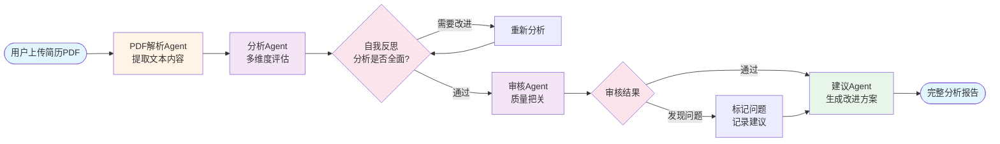

# 用阶跃星辰Step-3.5-Flash打造你的AI简历顾问

## 写在前面

如果你曾经为写简历而焦虑——不知道怎么突出亮点，担心HR看不到重点，投了几十份简历却石沉大海，那么这篇教程将带你做一件很实用的事情：**用AI帮你分析和优化简历**。

我们要用到的是**阶跃星辰的Step-3.5-Flash模型**。它是一个高性价比的大语言模型，推理速度快、成本低，特别适合需要快速响应的应用场景。更重要的是，它在文本理解和生成方面表现出色，能够像资深HR一样，从专业角度审视你的简历。

这个教程会带你从零开始，一步步搭建一个智能简历分析助手。它能自动解析PDF格式的简历，从HR和技术面试官的双重视角评估质量，针对具体问题给出可落地的改进建议，还会记录每次分析历史方便对比优化效果。

你不需要有任何AI开发经验，只需要跟着这个教程，把每一步做下来。准备好了吗？让我们开始吧。

## 第一步：理解我们要做什么

### 为什么需要AI简历顾问

在求职市场上，简历是你的第一张名片。但很多人写简历时会遇到这些问题：不知道怎么突出亮点，做了很多项目却不知道哪些该详细写；技术能力很强，但描述起来像流水账，HR看不出价值；排版混乱，重点信息被淹没在大段文字里；只说"负责XX项目"，没有量化的成果展示。

传统的做法是找朋友帮忙看，或者花钱找专业的简历优化服务。但朋友可能不够专业，付费服务又太贵。如果有一个AI助手，能像资深HR一样，从专业角度帮你分析简历，指出问题，给出具体的改进建议，那该多好？这就是我们今天要做的事情。

### 我们的解决方案

我们会搭建一个**多Agent协作系统**，让四个AI助手分工合作，完成简历分析任务。PDF解析Agent负责读取你的简历PDF，提取出所有文本内容；分析Agent像HR和技术面试官一样，从多个维度评估简历质量，它会先给出初步分析，然后通过自我反思机制检查分析是否全面；审核Agent会对分析结果进行质量把关，确保评分合理、建议可落地；最后建议Agent针对发现的问题，给出具体的改进方案。

这四个Agent会依次工作，最后生成一份完整的分析报告。报告包含简历的整体评分（结构、内容、表达等维度），发现的具体问题（比如缺少量化数据、技术栈描述不清晰等），以及改进建议（比如"将'负责XX项目'改为'主导XX项目，使XX指标提升30%'"）。所有的分析历史都会保存下来，方便你对比不同版本的简历，看看优化效果如何。

### 为什么选择Step-3.5-Flash

我们选择刚发布的 Step-3.5-Flash，是因为它是目前专为 Agent 场景打造的“特种兵”模型，在极致速度、长窗口与低成本之间达成了完美平衡。**它支持高达 256K 的超长上下文**，这意味着系统能一次性完整分析超长简历或复杂的项目历史，无惧信息丢失。得益于先进的稀疏 MoE 架构，其推理速度飙升至 350 tokens/s，分析一份简历仅需眨眼间，同时保持了极高的中文逻辑理解力与代码生成水平。此外，它完全兼容 OpenAI 接口规范，配合极具竞争力的API价格，让我们能用几行代码就以极低成本构建出企业级的简历分析系统。接下来，我们就开始动手搭建这个系统。

## 第二步：准备开发环境

### 安装Python和依赖

首先，确保你的电脑上安装了Python 3.10或更高版本。打开终端（Windows用户打开PowerShell，Mac和Linux用户打开Terminal），输入：

```bash
python --version
```

如果看到版本号（比如`Python 3.10.0`），说明Python已经安装好了。如果没有，去[Python官网](https://www.python.org/downloads/)下载安装。为了不影响其他项目，我们创建一个独立的虚拟环境：

```bash
# 创建虚拟环境
conda create -n resume_assistant python=3.10 -y

# 激活虚拟环境
conda activate resume_assistant
```

项目已经准备好了 `requirements.txt` 文件，使用以下指令安装依赖。

```bash
# 安装所有依赖
pip install -r requirements.txt
```

### 获取Step-3.5-Flash API密钥

要使用阶跃星辰的模型，你需要先获取API密钥：

1. 访问[阶跃星辰开放平台](https://platform.stepfun.com/)，点击右上角注册并登录账号


2. 在控制台创建API密钥，并复制密钥，保存好（后面会用到），新用户通常会有免费额度，足够我们完成这个教程的开发和测试。


### 验证环境

创建一个测试文件`test_env.py`，验证环境是否配置正确：

```python
from hello_agents import HelloAgentsLLM

# 连接Step-3.5-Flash模型
llm = HelloAgentsLLM(
    model="step-3.5-flash",
    base_url="https://api.stepfun.com/v1",
    api_key="替换成你的真实密钥"  # 替换成你刚刚复制的真实密钥
)

# 测试连接
messages = [{"role": "user", "content": "你好，请介绍一下你自己。"}]

response_text = ""
for chunk in llm.think(messages):
    response_text += chunk

print("✅ 环境配置成功！")
```

运行这个文件：

```bash
python test_env.py
```

如果看到模型的回复（类似"我是阶跃星辰开发的AI助手..."），说明环境配置成功了。

## 第三步：理解多Agent协作架构

在正式写代码之前，我们需要理解这个系统的核心设计思想。传统的AI应用往往是"一个模型包打天下"，但这种方式在处理复杂任务时会遇到瓶颈。就像你不会让一个人同时负责产品设计、代码开发、测试和运维一样，我们也不应该让一个AI模型承担所有职责。

### Agent的本质：专业化分工

Agent（智能体）不是简单的"会聊天的AI"，而是具备特定能力边界的专业角色。一个好的Agent应该像一个经验丰富的专家，知道自己擅长什么、不擅长什么，知道什么时候该把任务交给其他专家。

在我们的简历分析系统中，我们设计了四个高度专业化的Agent，每个都有明确的职责边界和专业能力。PDF解析Agent只关心如何从二进制文件中提取出干净的文本，它不需要理解"这份简历好不好"；分析Agent扮演HR和技术面试官的角色，它会从多个维度评估简历，但它不会去猜测"应该怎么改"；审核Agent像质检员，专门挑刺，确保分析结果经得起推敲；建议Agent则是优化顾问，它基于分析结果给出可落地的改进方案。

这种设计的好处是每个Agent的提示词可以高度聚焦，不需要在一个超长的提示词里塞进所有要求；出了问题容易定位，如果评分不准，就去调整分析Agent，如果建议不够具体，就去优化建议Agent；系统容易扩展，想加入"排版美化Agent"或"ATS优化Agent"，直接插入流程即可。

### 协作模式：流水线与反馈循环

我们采用的是**流水线协作模式**，但加入了**质量反馈机制**。简单的流水线是单向的，数据从上游流向下游，每个环节只执行一次。但在我们的系统中，分析Agent内部有一个自我反思循环（Reflection），它会先给出初步分析，然后像人类专家一样回过头来审视自己的结论，发现问题后自我修正。审核Agent则在流水线中充当质检关卡，如果发现分析结果有明显问题（比如评分过于宽松、缺少关键维度的评估），会标记出来并给出改进建议。

这种设计借鉴了软件工程中的"测试驱动开发"思想。分析Agent不是一次性输出结果就完事，而是要经过自我检验和外部审核两道关卡，避免了单次推理可能出现的偏差。


让我们用一张图来看清楚整个系统的运作流程：



这个架构平衡了效率和质量。大部分情况下，流程是线性的，速度很快；但在关键环节（分析和审核），我们引入了质量检查机制，确保输出结果的可靠性。分析Agent的Reflection机制是内部循环，可以设置最大的迭代轮数，避免陷入无限反思；审核Agent不会阻断流程，即使发现问题也会继续执行，只是会在报告中标记出来，供用户参考。

我们使用HelloAgents框架来实现这个多Agent系统，而不是从零开始写协作逻辑。HelloAgents提供了两个关键的Agent类型：**ReflectionAgent**和**SimpleAgent**。ReflectionAgent内置了自我反思机制，你只需要提供三个提示词（初始分析、反思、改进），它会自动管理反思循环；SimpleAgent则是标准的单次推理Agent，适合那些不需要反复迭代的任务。

接下来，我们就开始动手搭建这四个Agent。你会看到，有了清晰的架构设计，代码实现反而变得非常简洁。

## 第四步：实现四个专业Agent

现在我们开始动手实现系统的四个核心组件。源码已经在项目中提供（`resume_parser.py`、`resume_analyzer.py`、`resume_reviewer.py`、`resume_advisor.py`），这里我们重点解读每个Agent的设计思路和关键实现。

### PDF解析Agent：文本提取

简历PDF可能包含复杂的排版、多列布局、嵌入图片，甚至扫描件。我们选择微软开源的MarkItDown库，它能识别文档结构，将PDF转换为Markdown格式，保留标题、列表等语义信息。

核心实现在`ResumeParser`类中，关键代码：

```python
# 使用MarkItDown转换PDF
result = self.md_converter.convert(pdf_path)
content = result.text_content

# 清理：移除多余空行
lines = [line.strip() for line in content.split('\n') if line.strip()]
cleaned_content = '\n'.join(lines)
```

MarkItDown会自动处理各种复杂情况，我们调用`convert`方法，然后做基础的文本清理。相比RAG方案需要切分、向量化、建索引，这种方式更直接，对于简历这种篇幅不大的文档，不需要引入检索机制。

### 分析Agent：带自我反思的评估专家

分析Agent是整个系统的核心，它需要像资深HR一样，从多个维度评估简历质量。我们设计了五个评分维度：结构完整性（20分）、内容质量（30分）、表达专业性（20分）、格式规范性（15分）、技能匹配度（15分）。但更重要的是，我们引入了**Reflection机制**，让Agent能够自我审视和修正。

在`resume_analyzer.py`中，我们使用HelloAgents的`ReflectionAgent`：

```python
self.agent = ReflectionAgent(
    name="简历分析专家",
    llm=self.llm,
    max_iterations=2,  # 可自行设置
    custom_prompts={
        "initial": self._get_initial_prompt(),
        "reflect": self._get_reflect_prompt(),
        "refine": self._get_refine_prompt()
    }
)
```

这里的关键是三个提示词的设计。`initial`提示词定义了评分标准和输出格式，要求Agent严格按照五个维度打分，并以JSON格式返回结果；`reflect`提示词让Agent反思自己的分析，检查评分是否过于宽松、优缺点是否具体、有没有遗漏重要问题；`refine`提示词指导Agent根据反思结果重新给出更准确的分析。

这种设计的妙处在于，Agent不是一次性输出结果就完事，而是会经历"分析→反思→改进"的循环。比如它可能在初次分析时给了某份简历80分，但在反思阶段发现"这份简历缺少量化数据，内容质量不应该这么高"，然后在改进阶段将分数调整为65分，并补充更具体的问题描述。

### 审核Agent：质量把关的最后防线

即使有了自我反思，分析Agent也可能出现偏差。审核Agent的作用就是站在第三方视角，检查分析结果是否经得起推敲。它会关注三个关键点：评分是否合理（比如一份明显缺少项目经验的简历，内容质量分不应该很高）；优缺点是否具体（避免"内容丰富"这种空话）；是否遗漏重要问题（比如工作经历时间线断层）。

在`resume_reviewer.py`中，我们使用`SimpleAgent`，因为审核是单次判断，不需要反复迭代：

```python
self.agent = SimpleAgent(
    name="简历分析审核专家",
    system_prompt=self._get_system_prompt(),
    llm=self.llm
)
```

审核Agent的系统提示词定义了三个检查维度：评分合理性（各维度得分是否符合实际）、具体性（避免空洞的评价）、完整性（是否遗漏重要问题）。它会返回一个包含`pass`字段的JSON结果，如果发现问题，会在`issues`和`suggestions`字段中给出详细说明。

这种设计的巧妙之处在于，审核Agent不会阻断流程。即使它发现了问题，系统也会继续执行，只是会在最终报告中标记出审核意见，供用户参考。这避免了过度严格的质检导致系统无法输出结果的情况。

### 建议Agent：可落地的优化方案

建议Agent是整个流程的最后一环，它的任务是将分析结果转化为具体的改进建议。这里的关键是"可落地"，不能只说"内容需要优化"，而要给出"修改前"和"修改后"的对比示例。

在`resume_advisor.py`中，系统提示词明确要求：

```python
建议格式要求：每条建议包含问题描述、改进方向、具体示例。
示例要真实可信，符合简历场景。语言简洁专业，避免空洞的建议。

请以JSON格式返回建议列表：
{
    "suggestions": [
        {
            "category": "内容质量",
            "problem": "工作经历缺少量化数据",
            "solution": "在描述中加入具体的数据和成果",
            "example_before": "负责后端服务开发，参与多个项目",
            "example_after": "主导3个核心后端服务开发，优化接口响应时间50%，支撑日均100万次请求"
        }
    ],
    "priority_order": ["内容质量", "表达专业性", "结构完整性"]
}
```

这种设计让用户能够直接看到"应该怎么改"，而不是只知道"哪里有问题"。建议Agent会根据分析结果中的`weaknesses`字段，针对性地生成3-5条改进建议，并按照影响程度排序。

## 第五步：组装完整系统

四个Agent都实现好了，现在需要把它们串联起来。在`resume_assistant.py`中，我们创建了一个`ResumeAssistant`类，它负责协调整个分析流程：

```python
def analyze_resume(self, pdf_path: str, target_position: str = "软件工程师") -> dict:
    # 步骤1: 解析PDF
    resume_content = self.parser.parse_pdf(pdf_path)

    # 步骤2: 分析简历（带反思和审核）
    analysis = self.analyzer.analyze_with_review(resume_content, target_position)

    # 步骤3: 生成建议
    suggestions = self.advisor.generate_suggestions(resume_content, analysis)

    # 步骤4: 整合报告
    report = {
        "metadata": {...},
        "analysis": analysis,
        "suggestions": suggestions
    }

    return report
```

这个流程非常清晰：解析→分析→建议→报告。每个步骤都是独立的，出了问题容易定位。`analyze_with_review`方法内部会先调用分析Agent，然后自动调用审核Agent进行质量检查，这样外部调用者不需要关心内部的审核逻辑。

## 第六步：搭建交互界面

系统的核心逻辑已经完成，但我们需要一个友好的界面让用户使用。我们提供了两种交互方式：Web界面（基于Gradio）和命令行界面。

### Web界面：可视化操作

在`app.py`中，我们使用Gradio快速搭建了一个Web界面：


运行`python app.py`，浏览器会自动打开界面。上传PDF，填写目标岗位和API密钥，点击提交，几秒钟后就能看到完整的分析报告。报告以Markdown格式展示，包含评分、优缺点分析、具体改进建议，一目了然。

### 命令行界面：快速测试

如果你更喜欢命令行，可以直接运行：

```bash
python test_resume.py
```

这个脚本会读取项目中的测试简历，执行完整的分析流程，并将结果保存到`analysis_history`目录。所有的分析历史都会以JSON格式保存，方便你对比不同版本的简历，看看优化效果如何。

## 第七步：实战测试与优化

现在系统已经可以运行了，让我们用一份真实简历测试一下。准备一份PDF格式的简历，运行Web界面或命令行工具，观察分析结果。

你可能会发现一些有趣的现象。如果简历中大量使用"负责"、"参与"这种模糊词汇，分析Agent会在内容质量维度给出较低分数，并在反思阶段进一步降低评分；如果简历缺少量化数据，建议Agent会给出具体的修改示例，比如"将'优化系统性能'改为'优化系统性能，使响应时间从500ms降至200ms，提升60%'"；如果审核Agent发现分析结果评分过于宽松，会在报告中标记出来，提醒用户注意。

而且整个系统是可扩展的，你可以轻松添加新的Agent，比如"ATS优化Agent"（检查简历是否符合招聘系统的解析规则）或"行业适配Agent"（针对不同行业给出定制化建议）。

## 第八步：总结与展望

### 我们做了什么

通过这个教程，我们从零开始搭建了一个完整的AI简历分析系统。核心技术点包括：多Agent架构设计，将复杂任务分解为专业化的子任务；Reflection机制，让Agent能够自我审视和修正；质量审核机制，通过第三方视角确保输出稳定性；提示词工程，让AI扮演专业角色（HR、技术面试官、质检专家）。

### 关于Step-3.5-Flash

整个系统基于阶跃星辰的Step-3.5-Flash模型和HelloAgents框架，代码简洁，易于理解和扩展。Step-3.5-Flash的256K长上下文能力让我们可以一次性处理完整的简历，不需要切分；350 tokens/s的推理速度让分析过程几乎是即时的；极具竞争力的API价格让这个系统可以低成本运行。

如果你想进一步优化系统，可以考虑这些方向：增加更多评估维度，比如"职业发展连贯性"、"技能深度评估"；引入行业知识库，针对不同行业（互联网、金融、制造业）给出定制化建议；支持批量分析，一次性处理多份简历并生成对比报告；集成ATS检测，确保简历能被招聘系统正确解析。

### 写在最后

源码已经在项目中提供，简历优化是一个持续的过程。这个AI助手不能替代你的思考，但它可以帮你发现简历中的问题，提供专业的优化建议，让你从HR和面试官的角度审视自己的简历。希望这个教程能帮你搭建出自己的AI简历顾问，在求职路上助你一臂之力。祝你求职顺利！


