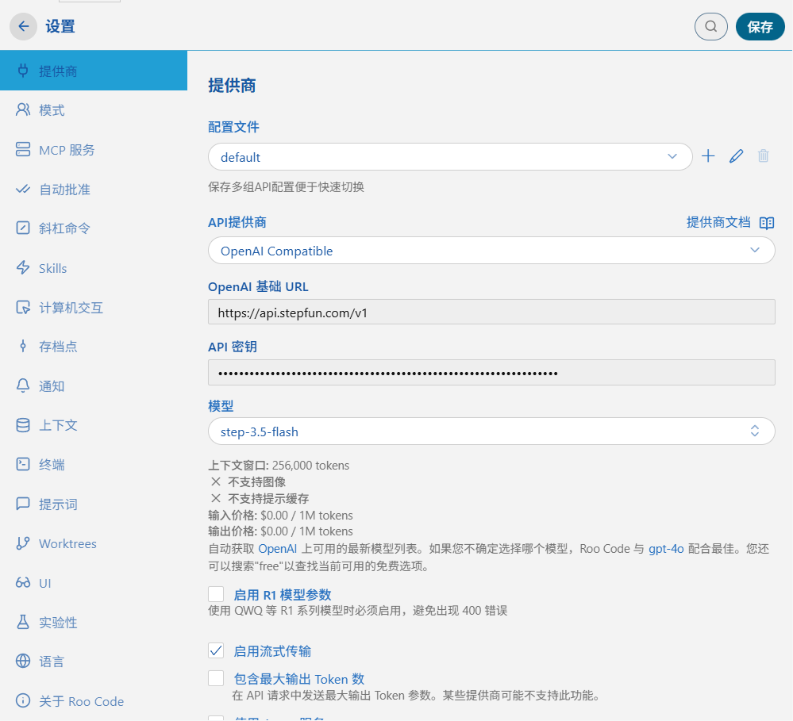
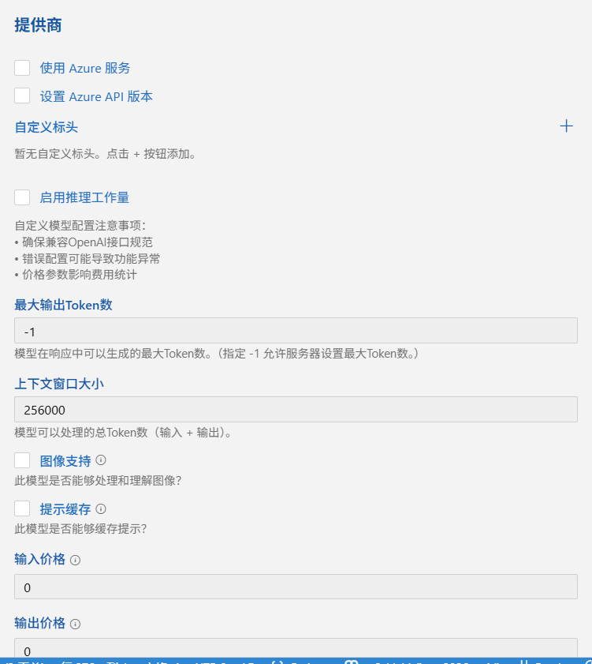

# 在 Roo Code 中集成 Step-3.5-Flash 实现自主编程代理

本教程介绍如何在流行的 VS Code 编程代理插件 **[Roo Code](https://roocode.com/)** (原 Roo Cline) 中配置并使用 **Step-3.5-Flash** 模型。通过结合 Roo Code 的自主执行能力与 Step-3.5-Flash 的强逻辑推理能力，开发者可以更高效地完成复杂的软件工程任务。

## 1. 为什么选择 Step-3.5-Flash + Roo Code？

- **顶尖推理能力**：Step-3.5-Flash 作为推理模型，能够深度理解 Roo Code 拆解的复杂指令。
- **256K 超长上下文**：允许 Roo Code 读取更多项目文件，提供更具全局观的代码改写建议。
- **高性价比与速度**：Flash 版本提供极快的响应速度，显著降低 Agent 在循环迭代中的等待时长。

## 2. 前置准备

1. **获取 API Key**：登录 [阶跃星辰开放平台](https://platform.stepfun.com/)，创建并获取您的 `API Key`。
2. **安装插件**：在 [VS Code 扩展市场](https://marketplace.visualstudio.com/)搜索并安装 `Roo Code`。

## 3. 配置指南

打开 Roo Code 设置界面（侧边栏图标 -> 顶部齿轮图标），按以下步骤配置：

### 3.1 基础连接设置
- **API Provider**: 选择 `OpenAI Compatible`
- **Base URL**: 输入 `https://api.stepfun.com/v1`
- **API Key**: 输入您的阶跃星辰 API 密钥
- **Model ID**: 输入 `step-3.5-flash`

### 3.2 模型规格定义
为了确保插件正确管理 Context Window 和生成上限，请务必手动调整以下参数：
- **Context Window (上下文窗口)**: 设置为 `256000` (256K)。
- **Max Output Token (最大输出)**: 建议设置为 `-1`（由服务器决定上限）
- **启用流式传输 (Stream)**：勾选，以获得实时的打字机输出效果。

更多配置参考截图：

## 4. 最佳实践

- **打开自动审批**：在 Roo Code 设置中启用自动审批功能，减少人为干预，提高开发效率。
- **先使用ASK而不是Code**：对于复杂任务，优先使用 ASK 模式获取模型的理解和建议，再进行代码生成, 否则由于flash速度太快，你可能跟不上其修改的速度而无法进行有效审查。
- **任务拆解**：利用 Roo Code 的任务拆解功能，将复杂任务分解为多个子任务，充分发挥 Step-3.5-Flash 的推理优势。
- **上下文管理**：合理利用 256K 上下文窗口，确保相关代码文件和依赖项被包含在上下文中，以获得更准确的建议。
- **迭代优化**：在每次生成后，审查代码并根据需要进行调整，利用 Step-3.5-Flash 的快速响应能力进行多轮迭代。

## 4. 总结

Step-3.5-Flash 的强推理能力与 Roo Code 的 MCP (Model Context Protocol) 及其自主工具调用能力相结合，为开发者提供了一个极具竞争力的 AI 编程工作流。它在保持极低延迟的同时，提供了足以媲美顶级模型的逻辑严密性。
